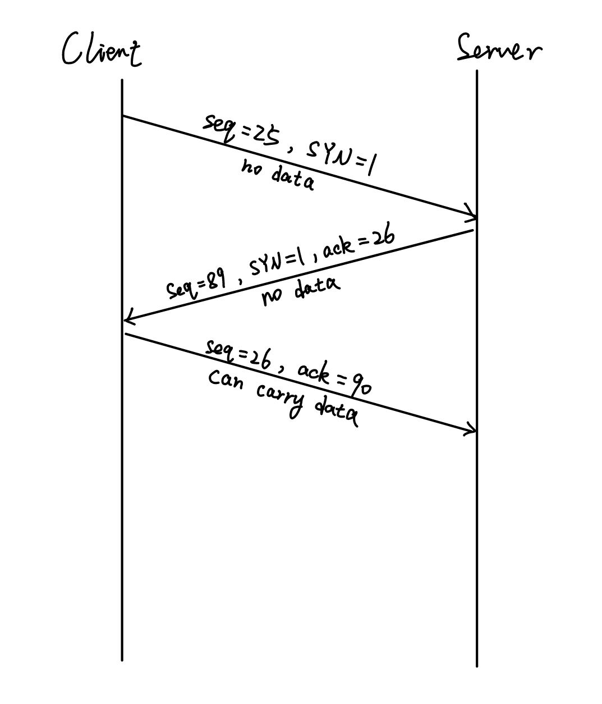

## Assignment 02

#### Q1

(a)

checksum = (0110 0110 0110 0000 + 0101 0101 0101 0101)' 

= (1011 1011 1011 0101)'

= 0100 0100 0100 1010

(b)

The receiver sum up the bits in the UDP datagram (including the checksum part), if the 16-bit number is not all 1, there must be at least one error.

(c)

No. If two errors occur at the same spot in checksum, the checksum can remain the same.

For example:

0110 0110 0110 0000  0101 0101 0101 0101  $\to$  011**1** 0110 0110 0000  010**0** 0101 0101 0101

#### Q2

(a)

B1: send ack0    B2: 0 1 **| 2 3 4 |** 5 6

(b)

B1: send ack2    B2: 0 1 2 3 **| 4 5 6 |**

#### Q3

No, the algorithm will not converge to an equal share algorithm.

The following is the graph.

As both the increasing and the decreasing are additive, the ratio point will always move along the line parallel to the equal bandwidth line, and it will never reach equal sharing.

#### Q4

#### Q5

(a)
$$
EstimatedRTT = \\
0.9^{4}·EstimatedRTT_{0} + \\
0.9^{3}·0.1·EstimatedRTT_{1} + \\
0.9^{2}·0.1·EstimatedRTT_{2} + \\
0.9·0.1·EstimatedRTT_{3} + \\
0.1·EstimatedRTT_{4}
$$
(b)
$$
EstimatedRTT = 0.9^{n}· EstimatedRTT_{0} + 
\sum_{i=1}^{n} 0.9^{n-i}·0.1·EstimatedRTT_{i}
$$
